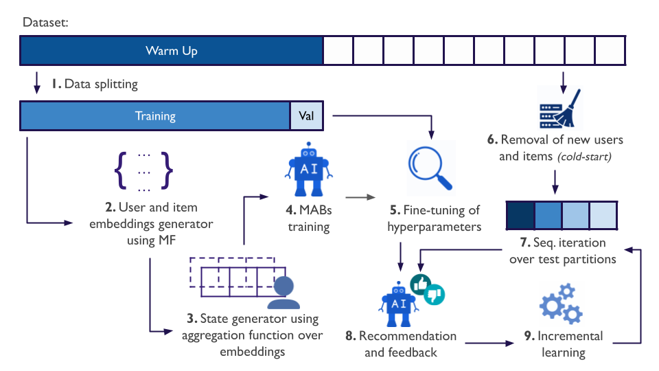

<div align="center">
    
Language

English | [Portuguese (BR)](./README_PT-BR.md)
    
</div>

# On the Impact of Matrix Factorization-based State Representation in Contextual Bandits Recommendation

Official repository for the paper "On the Impact of Matrix Factorization-based State Representation in Contextual Bandits Recommendation", $${\color{red}TODO: where published}$$

## Abstract

With the increasing availability of online information, recommender systems have become an important tool for many web-based systems. Due to the continuous aspect of recommendation environments, these systems increasingly rely on contextual multi-armed bandits (CMAB) to deliver personalized and real-time suggestions. A critical yet underexplored component in these systems is the representation of user state, which normally encapsulates the user's interaction history and deeply correlates with the model's decisions and learning. In this paper, we investigate the impact of different embedding-based state representations derived from matrix factorization models on the performance of traditional CMAB algorithms. Our large-scale experiments reveal that variations in state representation can lead to improvements greater than those achieved by changing the bandit algorithm itself, whose impact is often limited to minor decimal differences. Furthermore, no single embedding or aggregation strategy consistently dominates across datasets, underscoring the need for domain-specific evaluation. These results expose a substantial gap in the literature and emphasize that advancing bandit-based recommender systems requires a holistic approach that prioritizes embedding quality and state construction alongside algorithmic innovation.

## Key achievements

* To the best of our knowledge, we present the first large-scale empirical comparison of different state representations in contextual multi-armed bandits, demonstrating how this choice significantly affects model performance;
* We show that the choice of bandit algorithm often results in minor performance differences compared to the substantial impact of the selected context representation strategy;
* We identify a prominent gap in the literature: while much research emphasizes developing new algorithms, reward modeling techniques, and evaluation methods, the design of the environment's state representation remains largely overlooked.

Below we present a summary of the experimental protocol and the achieved results. More details can be found in the original paper.

## Experimental protocol



The evaluation followed a continuous protocol. Interaction logs were ordered by timestamp to reproduce a temporal recommendation flow. From each dataset, the first 50% of the interactions were designated as historical data for model initialization. Within this portion, a 10% slice was set aside for hyperparameter tuning, while the remainder was used to learn the embedding representation for users and items, and warm-up the CMABs algorithms. The second half of the data was dedicated exclusively to online evaluation.

User and item embeddings were first computed from the historical interactions, and user contexts were then derived by multiple types of aggregation of the learned embeddings, as explained further. These contexts served as input to the contextual bandit models, whose parameters were optimized with respect to the normalized discount cumulative gain in a top-20 recommendation scenario (NDCG@20) on the validation split. Since the embedding space was generated in a single, non-incremental pass, test instances containing previously unseen items were removed to avoid cold-start.

For the online stage, the test data was processed in 10 chronological windows, each containing 10% of the interactions. In each window, the models generated ranked recommendations, observed the actual user choice, and updated their linear predictors to incorporate the new feedback.

## Results

In this section, we show the results obtained. Consult our paper for more details.

### ALS-based Normalized discounted cumulative gain in a top-20 recommendation task (NDCG@20)


### BPR-based Normalized discounted cumulative gain in a top-20 recommendation task (NDCG@20)


### LinUCB cumulative NDCG@20 for every partition on the test set.


### LinGreedy cumulative NDCG@20 for every partition on the test set.


### LinTS cumulative NDCG@20 for every partition on the test set.


## Installing

The supported platforms for executing the code are the following:

- macOS 10.12+ x86_64.
- Linux x86_64 (including WSL on Windows 10).

There are two ways to install the libs: (1) installing manually and (2) using Docker (it works for Windows too).

### Installing manually

Executing the command below will install the necessary libraries:

```
pip install -r requirements.txt
```

or

```
python -m pip install -r requirements.txt
```

OBS 1: It is recommended to use a new conda environment before doing it to prevent breaking library versions of other codes.

OBS 2: Due to some of the used packages, this will not work on Windows (it will only work with WSL)

OBS 3: It is recommended to use the Python version 3.8.0

### Installing with Docker

To install the libraries with Docker, execute the following steps:

1- Build a Docker image:

```
docker build -t mab-recsys .
```

2- Run the Docker container:

```
docker run -it --gpus all --shm-size=8g \
    -v ./raw:/mab_recsys/raw \
    -v ./1-datasets:/mab_recsys/1-datasets \
    -v ./2-experiments:/mab_recsys/2-experiments \
    -v ./3-results:/mab_recsys/3-results \
    -v ./4-tex:/mab_recsys/4-tex \
    -v ./5-images:/mab_recsys/5-images \
    -v ./6-analyses:/mab_recsys/6-analyses \
    -v ./7-agg_results:/mab_recsys/7-agg_results \
    mab-recsys /bin/bash -c "source activate py38 && /bin/bash"
```

## Datasets

Downloading the datasets is necessary to run the experiments. A list with download link and where to save the files are given below:

- [AmazonBeauty](https://mcauleylab.ucsd.edu/public_datasets/data/amazon_2023/raw/review_categories/All_Beauty.jsonl.gz): put `All_Beauty.jsonl` file in `raw/amazon-beauty`
- [AmazonBooks](https://www.kaggle.com/datasets/mohamedbakhet/amazon-books-reviews): download and extract in `raw/amazon-books`
- [BestBuy](https://www.kaggle.com/c/acm-sf-chapter-hackathon-big/data?select=train.csv): put `train.csv` file in `raw/BestBuy`
- [Delicious2K](https://grouplens.org/datasets/hetrec-2011): download `hetrec2011-delicious-2k.zip` in the `Delicious Bookmarks` section and extract it in `raw/delicious2k`
- [MovieLens-100K](https://grouplens.org/datasets/movielens/): download `ml-100k.zip` in the `MovieLens 100K Dataset` section and extract it in `raw/ml-100k`
- [MovieLens-25M](https://grouplens.org/datasets/movielens/): download `ml-25m.zip` in the `MovieLens 25M Dataset` section and extract it in `raw/ml-25m`

## Executing the code

Execute the following scripts to reproduce our results:

### 1. Dataset preprocess

With the raw datasets downloaded (more details in [Datasets section](#Datasets)), it's necessary to preprocess them before generating the recommendations.
To do that, execute the following command:

```
python src/scripts/preprocess/main.py
```

Executing this Python code will ask you which datasets to preprocess. Input the datasets indexes separated by space to select the datasets.

Another way to select the datasets is by executing the command below:

```
python src/scripts/preprocess/main.py --datasets <datasets>
```

Replace `<datasets>` with the names (or indexes) of the datasets separated by comma (","). The available datasets to preprocess are:

- \[1\]: amazon-beauty
- \[2\]: amazon-books
- \[3\]: amazon-games
- \[4\]: bestbuy
- \[5\]: delicious2k
- \[6\]: delicious2k-urlPrincipal
- \[7\]: ml-100k
- \[8\]: ml-25m
- \[9\]: retailrocket
- all (it will use all datasets)

More information about this step can be found in the [documentation about preprocessing](./src/scripts/preprocess/README.md).

### 2. Generate embeddings (not_incremental training)

With the datasets downloaded and preprocessed, it's necessary to generate de embeddings which will be used as context for the contextual MABs.
To do that, execute the following command:

```
python src/scripts/not_incremental/main.py 
```

Executing this Python code will ask you which datasets and algorithms to use. Input the datasets and algorithms indexes separated by space to select the wanted options.

Another way to select the options is by executing the command below:

```
python src/scripts/not_incremental/main.py --algorithms <algorithms> --datasets <datasets>
```

Replace `<algorithms>` with the names (or indexes) of the algorithms separated by comma (","). The available algorithms to execute are:

- \[1\]: als
- \[2\]: bpr
- all (it will use all algorithms)

Replace `<datasets>` with the names (or indexes) of the datasets separated by comma (","). The available datasets to use as train/test are:

- \[1\]: amazon-beauty
- \[2\]: amazon-books
- \[3\]: amazon-games
- \[4\]: bestbuy
- \[5\]: delicious2k
- \[6\]: delicious2k-urlPrincipal
- \[7\]: ml-100k
- \[8\]: ml-25m
- \[9\]: retailrocket
- all (it will use all datasets)

More information about this step can be found in the [documentation about not incremental experiment](./src/scripts/not_incremental/README.md).

### 3. Run incremental experiments

With the embeddings generated, it is possible to train and test the contextual MABs.
For that, execute the following command:

```
python src/scripts/incremental/main.py 
```

Executing this Python code will ask you which datasets, algorithms, embeddings, and contexts to use. Input the options indexes separated by space to select the wanted options.

Another way to select the options is by executing the command below:

```
python src/scripts/incremental/main.py --algorithms <algorithms> --datasets <datasets> --embeddings <embeddings> --contexts <contexts>
```

Replace `<algorithms>` with the names (or indexes) of the incremental algorithms separated by comma (","). The available algorithms to execute are:

- \[1\]: Lin
- \[2\]: LinUCB
- \[3\]: LinGreedy
- \[4\]: LinTS
- all (it will use all algorithms)

Replace `<datasets>` with the names (or indexes) of the datasets separated by comma (","). The available datasets to use as train/test are:

- \[1\]: amazon-beauty
- \[2\]: amazon-books
- \[3\]: amazon-games
- \[4\]: bestbuy
- \[5\]: delicious2k
- \[6\]: delicious2k-urlPrincipal
- \[7\]: ml-100k
- \[8\]: ml-25m
- \[9\]: retailrocket
- all (it will use all datasets)

Replace `<embeddings>` with the names (or indexes) of the not incremental algorithms separated by comma (","). The embeddings generated by these algorithms will be used as part of the MAB context. So, it is necessary to generate the embeddings before (explained in [Section 2 about not incremental algorithms](#2-generate-embeddings-not_incremental-training)). The available embeddings are:

- \[1\]: als
- \[2\]: bpr
- all (it will use all embeddings)

Replace `<contexts>` with the names (or indexes) of the context generation strategies separated by comma (","). The available strategies are:

- \[1\]: user
- \[2\]: item_concat
- \[3\]: item_mean
- \[4\]: item_concat+user
- \[5\]: item_mean+user
- \[6\]: item_concat+item_mean
- \[7\]: item_concat+item_mean+user
- all (it will use all strategies)

More information about this step can be found in the [documentation about incremental experiment](./src/scripts/incremental/README.md).

### 4. Generate tables and graphics

After executing all the above commands, it is possible to generate tables and graphics to visualize the results.
For that, execute the following command:

```
python src/scripts/generate_metrics/main.py 
```

Executing this Python code will ask you which datasets, metrics, not incremental algorithms, incremental algorithms, embeddings, and contexts to use. Input the options indexes separated by space to select the wanted options.

Another way to select the options is by executing the command below:

```
python src/scripts/generate_metrics/main.py --datasets <datasets> --metrics <metrics> --not_incremental_algorithms <not_incremental_algorithms> --incremental_algorithms <incremental_algorithms> --embeddings <embeddings> --contexts <contexts>
```

Replace `<datasets>` with the names (or indexes) of the datasets separated by comma (","). The available datasets to use are:

- \[1\]: amazon-beauty
- \[2\]: amazon-books
- \[3\]: amazon-games
- \[4\]: bestbuy
- \[5\]: delicious2k
- \[6\]: delicious2k-urlPrincipal
- \[7\]: ml-100k
- \[8\]: ml-25m
- \[9\]: retailrocket
- all (it will use all datasets)

Replace `<metrics>` with the names (or indexes) of the metrics separated by comma (","). The available metrics are:
- \[1\]: ncdg
- \[2\]: hit rate (hr)
- \[3\]: f-score
- \[4\]: novelty
- \[5\]: coverage
- \[6\]: diversity
- all (it will use all metrics)

Replace `<not_incremental_algorithms>` with the names (or indexes) of the not incremental algorithms separated by comma (","). The non-incremental algorithms selected here will be used to compare the results with the incremental algorithms. The available not incremental algorithms are:

- \[1\]: als
- \[2\]: bpr
- all (it will use all algorithms)

Replace `<incremental_algorithms>` with the names (or indexes) of the incremental algorithms separated by comma (","). The available incremental algorithms to execute are:

- \[1\]: Lin
- \[2\]: LinUCB
- \[3\]: LinGreedy
- \[4\]: LinTS
- all (it will use all algorithms)

Replace `<embeddings>` with the names (or indexes) of the embeddings separated by comma (","). The selected not incremental algorithms here will be used to find results about incremental algorithms that used the embeddings of the selected embedding options. The available embeddings are:

- \[1\]: als
- \[2\]: bpr
- all (it will use all embeddings)

Replace `<contexts>` with the names (or indexes) of the context generation strategies separated by comma (","). The available strategies are:

- \[1\]: user
- \[2\]: item_concat
- \[3\]: item_mean
- \[4\]: item_concat+user
- \[5\]: item_mean+user
- \[6\]: item_concat+item_mean
- \[7\]: item_concat+item_mean+user
- all (it will use all strategies)

More information about this step can be found in the [documentation about metrics generation](./src/scripts/generate_metrics/README.md).

### 5. Aggregate results

A [Jupyter Notebook can be used to aggregate the results from multiple datasets](./src/notebooks/aggregate_results.ipynb). Change the necessary variables and execute the cell in the notebook to generate the aggregated graphics and tables.

## Citation

$${\color{red}TODO: update after publication}$$
If our project is useful or relevant to your research, please kindly recognize our contributions by citing our paper:

```bib
@inproceedings{<ref_name>,

}
```
