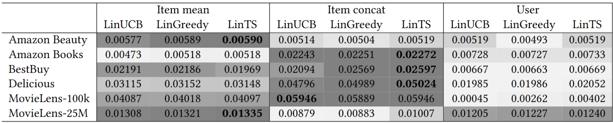
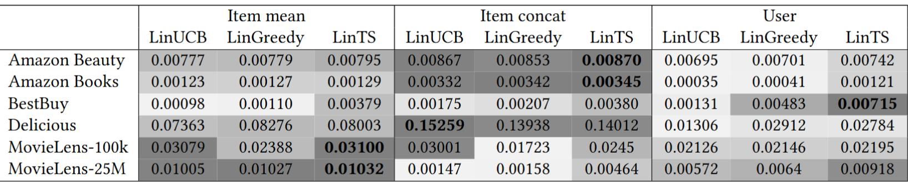
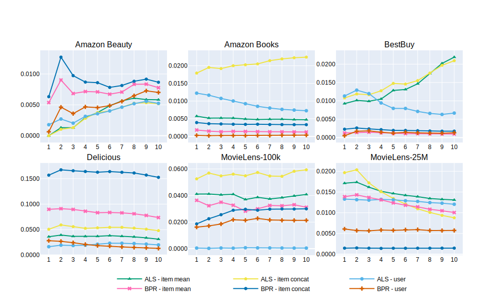
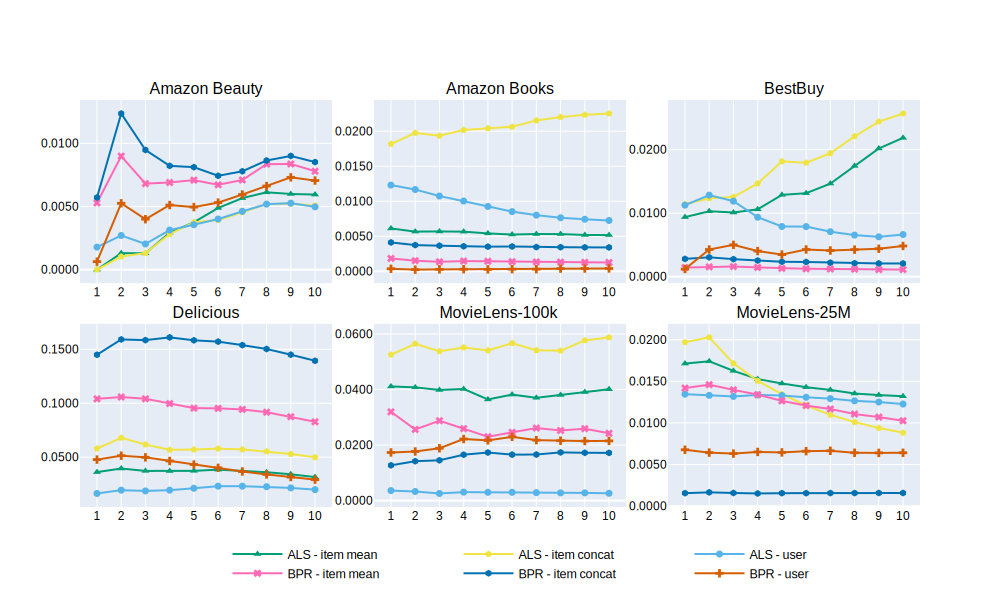
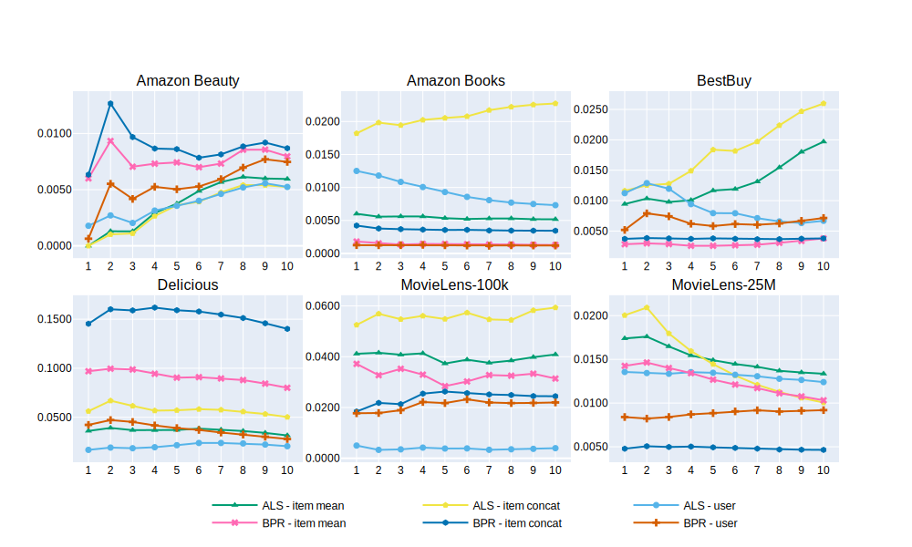

<div align="center">
    
Idioma

Português (BR) | [Inglês](./README.md)
    
</div>

# On the Impact of Matrix Factorization-based State Representation in Contextual Bandits Recommendation

Repositório oficial do artigo "On the Impact of Matrix Factorization-based State Representation in Contextual Bandits Recommendation", 
TODO:ondepublicado

## Resumo

Com a crescente disponibilidade de informações online, os sistemas de recomendação tornaram-se uma ferramenta importante para muitas plataformas baseadas na *web*. Devido ao caráter contínuo dos ambientes de recomendação, esses sistemas dependem cada vez mais de *contextual multi-armed bandits* (CMAB) para fornecer sugestões personalizadas e em tempo real. Um componente crítico, mas ainda pouco explorado, nesses sistemas é a representação do estado do usuário, que normalmente encapsula o histórico de interações do usuário e está profundamente correlacionada com as decisões e o aprendizado do modelo. Neste artigo, investigamos o impacto de diferentes representações de estado baseadas em *embeddings* derivados de modelos de fatoração de matrizes no desempenho de algoritmos CMAB tradicionais. Nossos experimentos em larga escala revelam que variações na representação de estado podem levar a melhorias maiores do que aquelas alcançadas pela simples troca do algoritmo de exploração, cujo impacto costuma se limitar a pequenas diferenças decimais. Além disso, nenhuma estratégia única de *embedding* ou de agregação se mostrou consistentemente dominante em todos os conjuntos de dados, ressaltando a necessidade de avaliações específicas por domínio. Esses resultados expõem uma lacuna substancial na literatura e enfatizam que o avanço dos sistemas de recomendação baseados em CMAB requer uma abordagem holística que priorize a qualidade dos *embeddings* e a construção do estado, em conjunto com a inovação algorítmica.

## Principais feitos

* Até onde sabe-se, foi apresentado a primeira comparação empírica em larga escala de diferentes representações de estado em *contextual multi-armed bandits* (CMAB), demonstrando como essa escolha afeta de forma significativa o desempenho do modelo;
* Foi mostrado que a escolha do algoritmo de CMAB frequentemente resulta em diferenças de desempenho pequenas quando comparada ao impacto substancial da estratégia de representação de contexto selecionada;
* Foi identificado uma lacuna proeminente na literatura: enquanto muitas pesquisas enfatizam o desenvolvimento de novos algoritmos, técnicas de modelagem de recompensa e métodos de avaliação, o design da representação de estado do ambiente permanece amplamente negligenciado.

A seguir é apresentado um resumo do protocolo experimental e dos resultados obtidos. Mais detalhes podem ser encontrados no artigo original.

## Protocolo experimental

A avaliação seguiu um protocolo contínuo. Os registros de interação foram ordenados por *timestamp* para reproduzir um fluxo temporal de recomendação. De cada base de dados, os primeiros 50% das interações foram designados como dados para o treinamento inicial do modelo. Dentro dessa porção, uma fatia de 10% foi reservada para ajuste de hiperparâmetros, enquanto o restante foi utilizado para aprender a representação em *embedding* de usuários e itens, além de realizar o aquecimento dos algoritmos CMAB. A segunda metade dos dados foi dedicada exclusivamente à avaliação online.

Os *embeddings* de usuários e itens foram inicialmente calculados a partir das interações, e os contextos de usuário foram então derivados por meio de diferentes tipos de agregação dos *embeddings* aprendidos, conforme explicado adiante. Esses contextos serviram como entrada para os modelos de CMAB, cujos parâmetros foram otimizados em relação ao *normalized discounted cumulative gain* (NDCG) em um cenário de recomendação top-20 (NDCG@20) na partição de validação. Como o espaço de *embedding* foi gerado em uma única passagem não incremental, interações de teste contendo itens não existentes na partição de treino foram removidas para evitar o problema de *cold-start*.

Na etapa online, os dados de teste foram processados em 10 janelas ordenadas cronologicamente, cada uma contendo 10% das interações. Em cada janela, os modelos geraram recomendações ranqueadas, observaram a escolha real do usuário e atualizaram seus preditores lineares para incorporar o novo *feedback*.


## Resultados

Nesta seção, os resultados são mostrados. Consulte nosso artigo para mais detalhes.

### *Normalized discounted cumulative gain* baseado no ALS em uma tarefa de recomendação top-20 (NDCG@20)



### *Normalized discounted cumulative gain* baseado no BPR em uma tarefa de recomendação top-20 (NDCG@20)



### Resultados do LinUCB com NDCG@20 acumulado para cada partição de teste.



### Resultados do LinGreedy com NDCG@20 acumulado para cada partição de teste.



### Resultados do LinTS com NDCG@20 acumulado para cada partição de teste.



## Instalação

As plataformas suportadas para execução do código são as seguintes:

* macOS 10.12+ x86_64.
* Linux x86_64 (incluindo WSL no Windows 10).

Existem duas maneiras de instalar as bibliotecas: (1) instalando manualmente e (2) usando Docker (funciona para Windows também).

### Instalação "manual"

A execução do comando abaixo instalará as bibliotecas necessárias:

```
pip install -r requirements.txt
```

ou

```
python -m pip install -r requirements.txt
```

OBS 1: Recomenda-se usar um novo ambiente conda antes de fazer isso para evitar quebrar versões de bibliotecas de outros códigos.

OBS 2: Devido a alguns dos pacotes usados, isso não funcionará no Windows (só funcionará com WSL).

OBS 3: Recomenda-se usar a versão 3.8.0 do Python.

### Instalando com o Docker

To install the libraries with Docker, execute the following steps:

1- Crie a imagem Docker:

```
docker build -t mab-recsys .
```

2- Rode o container:

```
docker run -it --gpus all --shm-size=8g \
    -v <path-to-datasets>:/weighted-sims/datasets \
    -v <path-to-raw>:/weighted-sims/raw \
    -v <path-to-results>:/weighted-sims/results \
    weighted-sims /bin/bash -c "source activate py38 && /bin/bash"
```

Substitua `<path-to-datasets>` por um caminho absoluto para salvar os conjuntos de dados pré-processados em sua máquina.

Substitua `<path-to-raw>` por um caminho absoluto para os conjuntos de dados brutos.

Substitua `<path-to-results>` por um caminho absoluto para salvar os resultados em sua máquina.

Dentro do contêiner, é possível executar os scripts deste repositório.

### Instalação com Docker

Para instalar as bibliotecas com Docker, execute os seguintes passos:

1- Construa uma imagem Docker:

```
docker build -t mab-recsys .
```

2- Execute o container Docker:

```
docker run -it --gpus all --shm-size=8g \
    -v ./raw:/mab_recsys/raw \
    -v ./1-datasets:/mab_recsys/1-datasets \
    -v ./2-experiments:/mab_recsys/2-experiments \
    -v ./3-results:/mab_recsys/3-results \
    -v ./4-tex:/mab_recsys/4-tex \
    -v ./5-images:/mab_recsys/5-images \
    -v ./6-analyses:/mab_recsys/6-analyses \
    -v ./7-agg_results:/mab_recsys/7-agg_results \
    mab-recsys /bin/bash -c "source activate py38 && /bin/bash"
```

## Bases de dados

O download dos conjuntos de dados é necessário para executar os experimentos. Uma lista com o link de download e onde salvar os arquivos é apresentada abaixo:

- [AmazonBeauty](https://mcauleylab.ucsd.edu/public_datasets/data/amazon_2023/raw/review_categories/All_Beauty.jsonl.gz): coloque `All_Beauty.jsonl` em `raw/amazon-beauty`
- [AmazonBooks](https://www.kaggle.com/datasets/mohamedbakhet/amazon-books-reviews): baixe e extraia em `raw/amazon-books`
- [BestBuy](https://www.kaggle.com/c/acm-sf-chapter-hackathon-big/data?select=train.csv): coloque `train.csv` em `raw/BestBuy`
- [Delicious2K](https://grouplens.org/datasets/hetrec-2011): download `hetrec2011-delicious-2k.zip` na Seção `Delicious Bookmarks` e extraia em `raw/delicious2k`
- [MovieLens-100K](https://grouplens.org/datasets/movielens/): download `ml-100k.zip` na Seção  `MovieLens 100K Dataset` e extraia em `raw/ml-100k`
- [MovieLens-25M](https://grouplens.org/datasets/movielens/): download `ml-25m.zip` na Seção `MovieLens 25M Dataset` e extraia em `raw/ml-25m`

## Executando o código

### 1. Pré-processamento das bases de dados

Com os conjuntos de dados brutos baixados (mais detalhes na [Seção conjuntos de dados](#Bases-de-dados)), é necessário pré-processá-los antes de gerar as recomendações.
Para isso, execute o seguinte comando:

```
python src/scripts/preprocess/main.py
```

A execução deste código Python perguntará quais conjuntos de dados pré-processar. Digite os índices das bases de dados separados por espaço para selecioná-las.

Outra forma de selecionar as bases de dados é executando o comando abaixo:

```
python src/scripts/preprocess/main.py --datasets <datasets>
```

Substitua `<datasets>` pelos nomes (ou índices) dos conjuntos de dados separados por vírgula (","). Os conjuntos de dados disponíveis para pré-processamento são:

- \[1\]: amazon-beauty
- \[2\]: amazon-books
- \[3\]: amazon-games
- \[4\]: bestbuy
- \[5\]: delicious2k
- \[6\]: delicious2k-urlPrincipal
- \[7\]: ml-100k
- \[8\]: ml-25m
- \[9\]: retailrocket
- all (it will use all datasets)

Mais informações sobre esta etapa podem ser encontradas na [documentação sobre pré-processamento](./src/scripts/preprocess/README-PT-BR.md).

### 2. Gerar embeddings (treinamento não incremental)

Com as bases de dados baixadas e pré-processadas, é necessário gerar as embeddings que serão usadas como contexto para os MABs contextuais.
Para isso, execute o seguinte comando:

```
python src/scripts/not_incremental/main.py
```

A execução deste código Python perguntará quais conjuntos de dados e algoritmos usar. Digite os índices dos conjuntos de dados e algoritmos separados por espaço para selecionar as opções desejadas.

Outra forma de selecionar as opções é executando o comando abaixo:

```
python src/scripts/not_incremental/main.py --algorithms <algorithms> --datasets <datasets>
```

Substitua `<algorithms>` pelos nomes (ou índices) dos algoritmos separados por vírgula (","). Os algoritmos disponíveis para execução são:

- \[1\]: als
- \[2\]: bpr
- all (usará todos os algoritmos)

Substitua `<datasets>` pelos nomes (ou índices) das bases de dados separadas por vírgula (","). Os conjuntos de dados disponíveis para uso como treino/teste são:

- \[1\]: amazon-beauty
- \[2\]: amazon-books
- \[3\]: amazon-games
- \[4\]: bestbuy
- \[5\]: delicious2k
- \[6\]: delicious2k-urlPrincipal
- \[7\]: ml-100k
- \[8\]: ml-25m
- \[9\]: retailrocket
- all (usará todos os conjuntos de dados)

Mais informações sobre esta etapa podem ser encontradas na [documentação sobre o experimento não incremental](./src/scripts/not_incremental/README-PT-BR.md).

### 3. Executar experimentos incrementais

Com as embeddings geradas, é possível treinar e testar os MABs contextuais.
Para isso, execute o seguinte comando:

```
python src/scripts/incremental/main.py
```

A execução deste código Python perguntará quais conjuntos de dados, algoritmos, embeddings e contextos usar. Digite os índices das opções separados por espaço para selecionar as opções desejadas.

Outra forma de selecionar as opções é executando o comando abaixo:

```
python src/scripts/incremental/main.py --algorithms <algorithms> --datasets <datasets> --embeddings <embeddings> --contexts <contexts>
```

Substitua `<algorithms>` pelos nomes (ou índices) dos algoritmos incrementais separados por vírgula (","). Os algoritmos disponíveis para execução são:

- \[1\]: Lin
- \[2\]: LinUCB
- \[3\]: LinGreedy
- \[4\]: LinTS
- all (usará todos os algoritmos)

Substitua `<datasets>` pelos nomes (ou índices) dos conjuntos de dados separados por vírgula (","). Os conjuntos de dados disponíveis para uso como treino/teste são:

- \[1\]: amazon-beauty
- \[2\]: amazon-books
- \[3\]: amazon-games
- \[4\]: bestbuy
- \[5\]: delicious2k
- \[6\]: delicious2k-urlPrincipal
- \[7\]: ml-100k
- \[8\]: ml-25m
- \[9\]: retailrocket
- all (usará todos os conjuntos de dados)

Substitua `<embeddings>` pelos nomes (ou índices) dos algoritmos não incrementais separados por vírgula (","). As embeddings geradas por esses algoritmos serão usadas como parte do contexto MAB. Portanto, é necessário gerar as embeddings antes (explicado na [Seção 2 sobre algoritmos não incrementais](#2-Gerar-embeddings-treinamento-não-incremental)). As embeddings disponíveis são:

- \[1\]: als
- \[2\]: bpr
- all (usará todas as embeddings)

Substitua `<contexts>` pelos nomes (ou índices) das estratégias de geração de contexto separadas por vírgula (","). As estratégias disponíveis são:

- \[1\]: user
- \[2\]: item\_concat
- \[3\]: item\_mean
- \[4\]: item\_concat+user
- \[5\]: item\_mean+user
- \[6\]: item\_concat+item\_mean
- \[7\]: item\_concat+item\_mean+user
- all (usará todas as estratégias)

Mais informações sobre esta etapa podem ser encontradas na [documentação sobre o experimento incremental](./src/scripts/incremental/README-PT-BR.md).

### 4. Gerar tabelas e gráficos

Após executar todos os comandos acima, é possível gerar tabelas e gráficos para visualizar os resultados.
Para isso, execute o seguinte comando:

```
python src/scripts/generate_metrics/main.py
```

A execução deste código Python perguntará quais conjuntos de dados, métricas, algoritmos não incrementais, algoritmos incrementais, embeddings e contextos usar. Digite os índices das opções separados por espaço para selecionar as opções desejadas.

Outra forma de selecionar as opções é executando o comando abaixo:

```
python src/scripts/generate_metrics/main.py --datasets <datasets> --metrics <metrics> --not_incremental_algorithms <not_incremental_algorithms> --incremental_algorithms <incremental_algorithms> --embeddings <embeddings> --contexts <contexts>
```

Substitua `<datasets>` pelos nomes (ou índices) dos conjuntos de dados separados por vírgula (","). Os conjuntos de dados disponíveis para uso são:

- \[1\]: amazon-beauty
- \[2\]: amazon-books
- \[3\]: amazon-games
- \[4\]: bestbuy
- \[5\]: delicious2k
- \[6\]: delicious2k-urlPrincipal
- \[7\]: ml-100k
- \[8\]: ml-25m
- \[9\]: retailrocket
- all (usará todos os conjuntos de dados)

Substitua `<metrics>` pelos nomes (ou índices) das métricas separadas por vírgula (","). As métricas disponíveis são:

- \[1\]: ncdg
- \[2\]: hit rate (hr)
- \[3\]: f-score
- \[4\]: novelty
- \[5\]: coverage
- \[6\]: diversity
- all (usará todas as métricas)

Substitua `<not_incremental_algorithms>` pelos nomes (ou índices) dos algoritmos não incrementais separados por vírgula (","). Os algoritmos não incrementais selecionados aqui serão usados para comparar os resultados com os algoritmos incrementais. Os algoritmos não incrementais disponíveis são:

- \[1\]: als
- \[2\]: bpr
- all (usará todos os algoritmos)

Substitua `<incremental_algorithms>` pelos nomes (ou índices) dos algoritmos incrementais separados por vírgula (","). Os algoritmos incrementais disponíveis para execução são:

- \[1\]: Lin
- \[2\]: LinUCB
- \[3\]: LinGreedy
- \[4\]: LinTS
- all (usará todos os algoritmos)

Substitua `<embeddings>` pelos nomes (ou índices) das embeddings separados por vírgula (","). Os algoritmos não incrementais selecionados aqui serão usados para encontrar resultados sobre algoritmos incrementais que usaram as embeddings das opções de embedding selecionadas. As embeddings disponíveis são:

- \[1\]: als
- \[2\]: bpr
- all (usará todos as embeddings)

Substitua `<contexts>` pelos nomes (ou índices) das estratégias de geração de contexto separadas por vírgula (","). As estratégias disponíveis são:

- \[1\]: user
- \[2\]: item\_concat
- \[3\]: item\_mean
- \[4\]: item\_concat+user
- \[5\]: item\_mean+user
- \[6\]: item\_concat+item\_mean
- \[7\]: item\_concat+item\_mean+user
- all (usará todas as estratégias)

Mais informações sobre esta etapa podem ser encontradas na [documentação sobre a geração de métricas](./src/scripts/generate_metrics/README_PT-BR.md).

### 5. Agregar resultados

Um [Jupyter Notebook pode ser usado para agregar os resultados de várias bases de dados](./src/notebooks/aggregate_results.ipynb). Altere as variáveis necessárias e execute as células no notebook para gerar os gráficos e tabelas agregados.

## Citação

$${\color{red}TODO: atualizar após a publicação}$$
Se nosso projeto for útil ou relevante para sua pesquisa, por favor, cite nosso artigo:

```bib
@inproceedings{<ref_name>,

}
```
